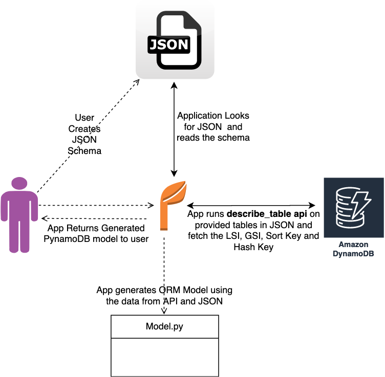

## Auto-generate PynamoDB models and CRUD functions


Oftentimes, there are Amazon DynamoDB tables available that require entities and CRUD operations functions to perform database operations efficiently. This pattern aims to provide a library that streamlines the creation of PynamoDB models and CRUD operation functions automatically. While it generates essential CRUD (Create, Read, Update, Delete) functions for database tables it also provides valuable capability of reverse engineering from Amazon DynamoDB tables. With this pattern, python developers and customers can effortlessly interact with Amazon DynamoDB tables, making it an invaluable tool for simplifying database operations in Python-based application.

The key features are:

1. JSON Schema to PynamoDB Model: Auto-generate PynamoDB models in python by importing a JSON schema file.

2. CRUD Function Generation: Auto-generate CRUD functions to perfrom create, read , update and delete operations on DynamoDB tables

3. Reverse Engineering DynamoDB: Reverse engineer PynamoDB models and CRUD functions for pre-existing Amazon DynamoDB tables using PynamoDB ORM.


# Prerequisites and limitations
- An active AWS account

- Python 3.8+ - The Python programming environment. 

- Target DynamoDB Tables in AWS account for which Object Relationship Mapping needs to be generated.

- AWS Command Line Interface - installed on your machine


# Architecture
## Target technology stack


1. #### Python: 
   Python is a high-level, general-purpose programming language. Its design philosophy emphasizes code readability with the use of significant indentation. Python is dynamically-typed and garbage-collected.

2. #### PynamoDB: 
    PynamoDB is a Pythonic interface to Amazon’s DynamoDB. By using simple, yet powerful abstractions over the DynamoDB API, PynamoDB allows you to start developing immediately.

3. #### DynamoDB: 
    Amazon DynamoDB is a fully managed, serverless, key-value NoSQL database designed to run high-performance applications at any scale. DynamoDB offers built-in security, continuous backups, automated multi-Region replication, in-memory caching, and data import and export tools.

# Target architecture flow




1. User creates input JSON schema file. This JSON schema represents the attributes of the respective DynamoDB tables from which you want to create Models and CRUD functions for. It contains three important keys namely:

   - **name** : This key defines the name of the target table

   - **region** : The AWS region in which tables exist

   - **attributes** : The attributes that are part of the target table i.e. Hash Key, Sort Key, Local Secondary Indexes, Global Secondary Indexes and non-key attributes. This tool expects the input schema to only provide the non-key attributes as the application fetches the key attributes directly from the target table. Each attribute should provide the details including the ‘name’ and the ‘type’ as shown in the following example:


2. User executes the application, by providing above JSON schema file as input to the tool. Refer to Additional Information section to know more about the symentics of input JSON schema.


3. Application connects to DynamoDB tables to derive the schema and datatypes.


4. Application runs describe_table on the table to fetch the Hash Key, Sort Key and any GlobalSecondaryIndexes and LocalSecondaryIndexes for each table .

Application combines the attributes provided in JSON and attributes fetched from describe_table.

Application uses Jinja template engine to generate PynamoDB ORM models and corresponding CRUD functions for each table


# Using the Tool

### Setup the environment

1. Setup and install AWS CLI
   1. Run aws configure command on command prompt (Windows) or terminal (Linux/macOS).
       ```cmd
        aws configure;
        ```
   2. Enter your AWS Access Key ID and Secret Access Key and region


2. Clone the repository
3. Setup Python Environment

   Navigate to the application parent directory ```reverse_engineer_dynamo``` and run ```pip install -r requirements.txt``` to install the required libraries and packages


### Generate Models and CRUD functions
1. Navigate to the parent directory : reverse_engineer_dynamo
    ```cmd 
    cd reverse_engineer_dynamo
    ```
2. Navigate to the parent directory : reverse_engineer_dynamo
    ```cmd
   python main.py --file <input_schema.json>
    ```
   
### Verify generated Models and CRUD functions
1. The generated PynamoDB model script by default names as ```demo_model.py``` and is generated inside a directory called models.
    ```cmd
   cd models/demo_model.py
    ```
2. The generated CRUD functions script by default names as demo_crud.py and is generated inside a directory called crud.
    ```cmd
   cd crud/demo_crud.py
    ```

## References:
- [Amazon DynamoDB](https://aws.amazon.com/dynamodb/)

- [PynamoDB](https://pynamodb.readthedocs.io/en/stable/index.html)

- [Jinja](https://jinja.palletsprojects.com/en/3.1.x/)

## Security

See [CONTRIBUTING](CONTRIBUTING.md#security-issue-notifications) for more information.

## License

This library is licensed under the MIT-0 License. See the LICENSE file.

